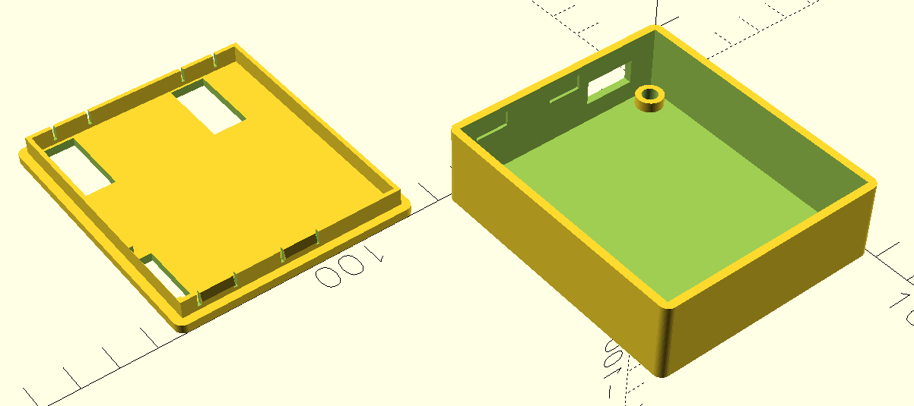

# amigahid-pico case

Parametric two-part snap-fit enclosure for the [**amigahid-pico**](https://github.com/borb/amigahid-pico/) PCB.



(LLM involved in the case generation, because of my curiosity. (What can be done with proper instructions?)

---

## Prerequisites

- **OpenSCAD** — rendering, preview, and `.csg`/`.stl` export.
- **FreeCAD** — converting the OpenSCAD CSG into a STEP.

---

## Views

The model has a `view` parameter selecting what gets rendered. Override it from the
command line with `-D 'view="..."'` (no need to edit the file):

| `view` | Purpose |
| --- | --- |
| `print` *(default)* | Both parts laid flat for printing — lid flipped lip-up. |
| `parts` | Shell + lid upright, side by side. **Use this for STEP export.** |
| `assembled` | Lid mated onto the shell. |

---

## OpenSCAD — render and export

**Export an STL** (e.g. straight-to-slicer, print layout):

```sh
"$OPENSCAD" -o /tmp/case-print.stl amigahid-pico-case.scad
```

**Export the CSG** needed for the STEP pipeline — use the `parts` view so the two
solids come out upright and cleanly separated:

```sh
"$OPENSCAD" -o /tmp/check.csg -D 'view="parts"' amigahid-pico-case.scad
```

**Render a preview PNG** (handy for sanity-checking a change):

```sh
"$OPENSCAD" -o /tmp/preview.png --imgsize=1200,900 -D 'view="assembled"' amigahid-pico-case.scad
```

---

## FreeCAD — convert CSG → STEP

OpenSCAD's own STEP export is mesh-based; FreeCAD's `importCSG` instead rebuilds
the geometry as a true B-rep (mathematically round cylinders, exact planes), which
is what you want for CAD reuse. The helper scripts live in `tools/`:

**1. Export the STEP** — `tools/to_step.py` opens the CSG, recomputes, and exports the
top-level solid(s):

```sh
"$FREECAD_CLI" tools/to_step.py /tmp/check.csg amigahid-pico-case.step
```

The script reports any failed objects and the top-level solid count/volume. The
`Recompute failed` lines it prints for intermediate nodes are harmless as long as
`FAILED objects: none` and the final object reports `valid=True`.

**2. Verify the STEP** — `tools/verify_step.py` reports solids, face counts, bounding
box, and per-solid volume:

```sh
"$FREECAD_CLI" tools/verify_step.py amigahid-pico-case.step
```

Expected: **2 solids** (shell + lid), both `valid=True`.

---

## End-to-end: regenerate the STEP after editing the SCAD

```sh

# 1. SCAD -> CSG (parts view)
"$OPENSCAD" -o /tmp/check.csg -D 'view="parts"' amigahid-pico-case.scad

# 2. CSG -> STEP
"$FREECAD_CLI" tools/to_step.py /tmp/check.csg amigahid-pico-case.step

# 3. Verify the result
"$FREECAD_CLI" tools/verify_step.py amigahid-pico-case.step
```

### Optional: confirm no features were dropped

The CSG importer is robust but worth spot-checking after structural edits. Render
the same `parts` view to STL, measure its mesh volume, and compare to the STEP's
solid volume — they should match within rounding (~1 mm³):

```sh
"$OPENSCAD" -o /tmp/check.stl -D 'view="parts"' amigahid-pico-case.scad
"$FREECAD_CLI" tools/mesh_vol.py /tmp/check.stl        # OpenSCAD mesh volume
"$FREECAD_CLI" tools/verify_step.py amigahid-pico-case.step   # STEP solid volume(s)
```

A large mismatch means a feature failed to import — re-check the
`to_step.py` output for failed objects.

---

## Printing notes

- Material: **PETG** (the snap lip flexes; PETG tolerates the relief slits well).
- Mounting: **2× M3 (Voron standard) heat-set inserts**.
  Print orientation is built into the `print` view: the lid comes out lip-up so
  the snap bumps' 45° retention bevels print without overhang.
- After a test print, the main tuning knobs in the SCAD are `pcb_clearance`
  (board fit), the `snap_*` group (snap feel/retention), and the `usba_*` group
  (`usba_height` / `usba_z_above_pcb` for the USB-A opening size and height).
